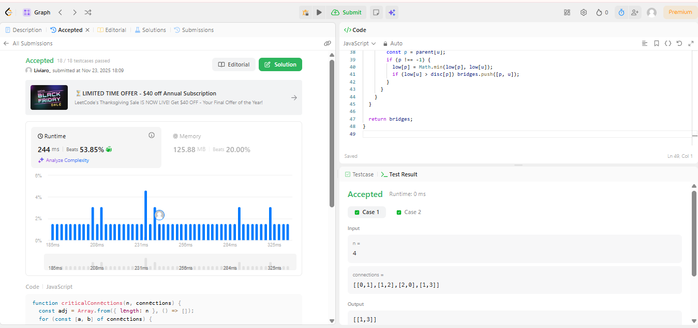
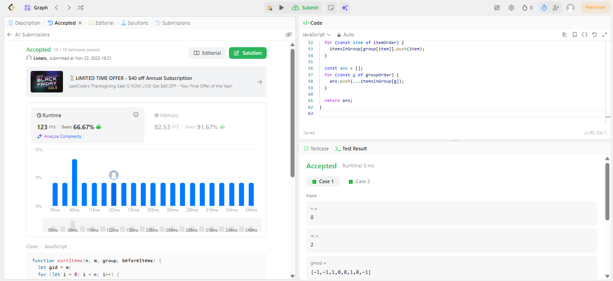
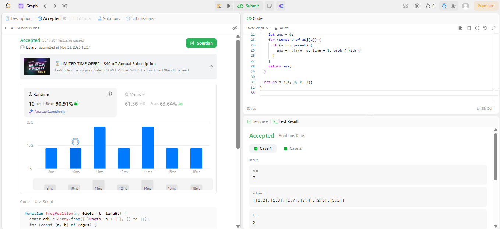
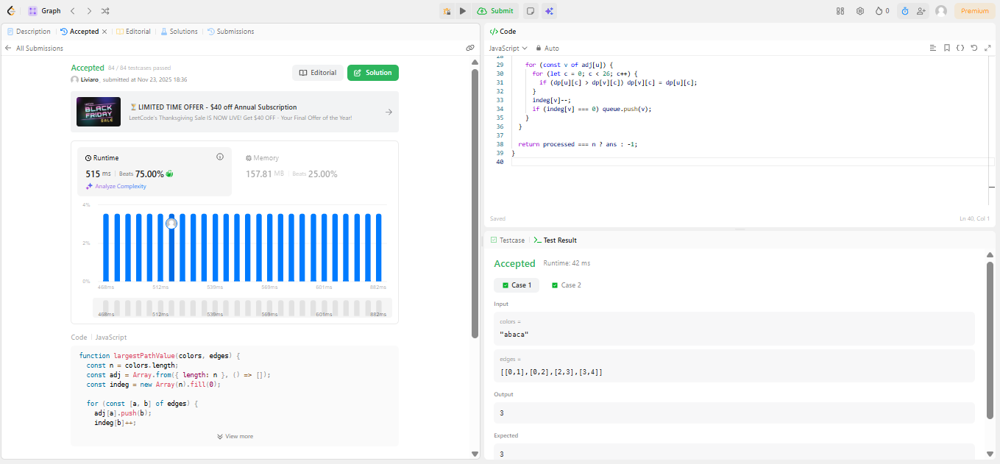

# Grafos-Grupo13

Isabella Carneiro - 180019066
Livia Rodrigues - 180105051

Neste trabalho, escolhemos **4 exercícios de nível difícil do LeetCode** com o objetivo de demonstrar nosso conhecimento em algoritmos, estruturas de dados, raciocínio lógico e especialmente sobre o tema Grafos.

## Exercícios Escolhidos

1. **1192. Critical Connections in a Network** - [Link para o problema](https://leetcode.com/problems/critical-connections-in-a-network/description/?envType=problem-list-v2&envId=graph)
2. **11203. Sort Items by Groups Respecting Dependencies** - [Link para o problema](https://leetcode.com/problems/sort-items-by-groups-respecting-dependencies/description/?envType=problem-list-v2&envId=graph)
3. **1377. Frog Position After T Seconds** - [Link para o problema](https://leetcode.com/problems/frog-position-after-t-seconds/description/?envType=problem-list-v2&envId=graph)
4. **1857. Largest Color Value in a Directed Graph** - [Link para o problema](https://leetcode.com/problems/largest-color-value-in-a-directed-graph/description/?envType=problem-list-v2&envId=graph)

## Submissões

**1192. Critical Connections in a Network**

**1203. Sort Items by Groups Respecting Dependencies**

**1377. Frog Position After T Seconds**

**1857. Largest Color Value in a Directed Graph**

## Objetivo

O objetivo deste trabalho é aplicar os conceitos aprendidos em sala de aula, explorando problemas de alta complexidade, e apresentar soluções eficientes e bem documentadas.

## Estrutura do Repositório

- Os arquivos seguem a convenção de nomenclatura baseada no nome ou número do problema no LeetCode.

## Apresentação

**Algoritmos de Ordenação LeetCode** - [Link para a apresentação](https://youtu.be/n9vN0MzT_gg)
